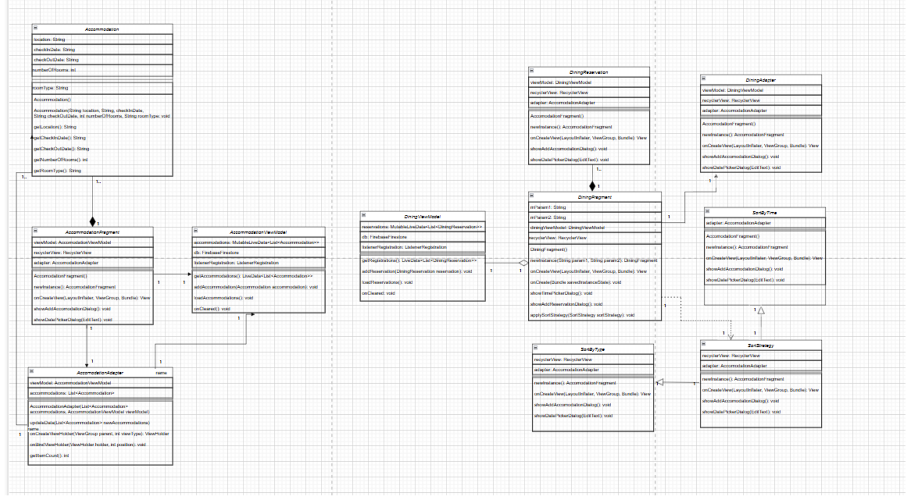
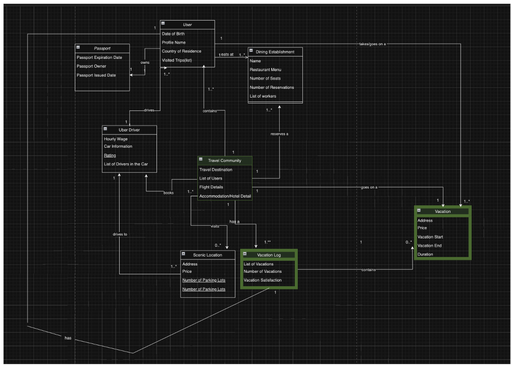
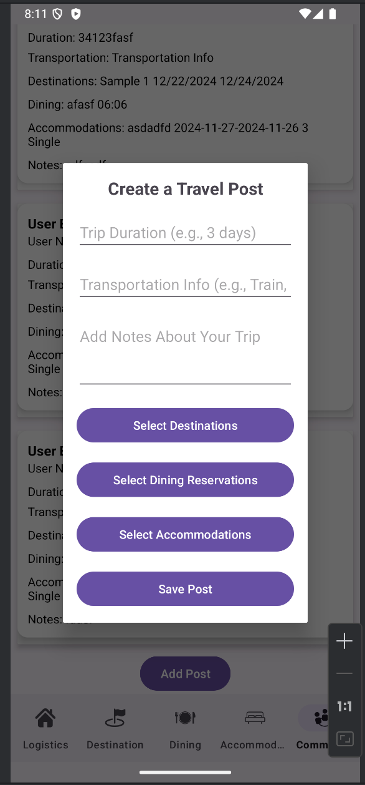
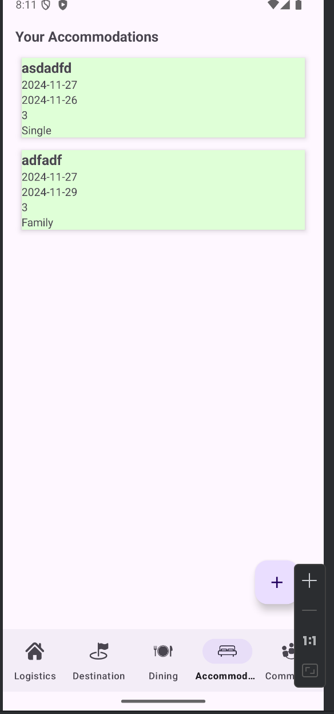
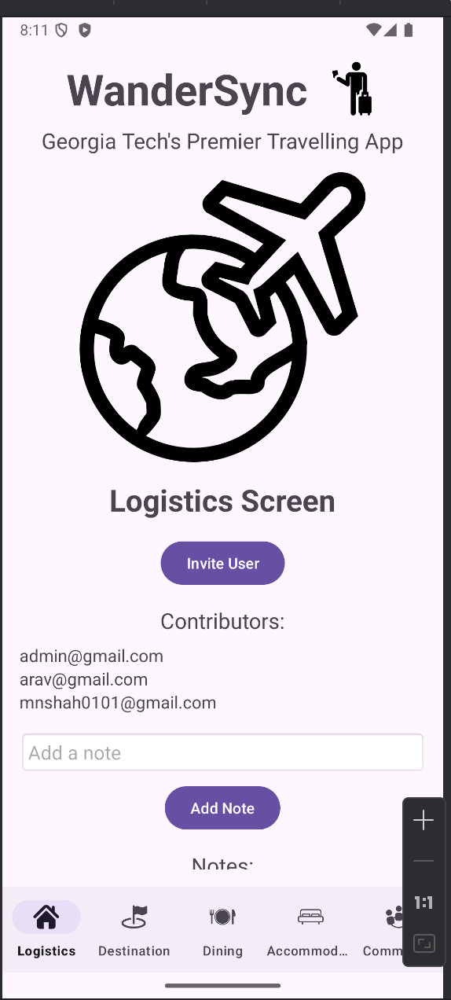

# Team402340Page

## Welcome to WanderSync: A Collaborative Travel Management System Project Review

### Hey, we worked on this website as a team! This was a great experience and we hope you enjoy.

Our project was an itinerary app that helped people simplify the process of keeping track of all their trips. It had many great features that allowed users to have an incredible experience. For example, users could use the app to plan/organise trips. They can put in the locations of their trip, where they're going, and even calculate their trip length. Furthermore, something very interesting is that users could also add other people to join their trip planning. When multiple people were in teh same group, they could add comments about their project as well.

## Reflections:

Overall, we all had a great time in this course. For me, we truly understood the importance of communication in software engineering. For example, when you're working on a team, you'll have to make sure htat no one steps on each other's toes. For us, we always didn't allot work the right way, and so sometimes two people would work on the same task. We then would end up running into some errors with merge conflicts as each person approached it in the same way. I did learn a lot of important concepts from Android Studio such as the idea of fragments. Fragements were super helpful, and they really simplified our UI, making each page easy to modify. I'm glad that we used fragments, because then we just had to use the one Home Page in all sections. Furthermore, I also learned the importance of Firebase. I had never used Firebase before for any of my projects. However, through Realtime Databse, we were able to make some incredible improvements. For example, I was the person who helped create the sign-in feature. Altough it was a bit triky to utilise Firebase at the start, Professor Roy's videos were super helpful in making sure that I understood the essential concepts. 

## Design + Architecture

##### Architecture
Overall, here is our architecture that we used for WanderSync.

For frontend, we're using Android Studio, ensuring a great UI for users and an intuitive experience.

For backend, Firebase powers the backend offering real-time data management and synchronization across all devices for users. Firetime Realtime Database was the hub for storing all user information, managing reservations and making plans.

#### Design Patterns

We attempted to follow many design patterns in the innovation of our project. By following many helpful design patterns that we learned in the class, it made sure that our code is mantainable, and it will be easier for us to make updates/changes if needed to. Our team really emphasized the use of the various patterns.

For example in our application, we wanted to employ the use of the Strategy Pattern.  In this sprint, we used the strategy pattern, for we wanted to allow the user to use different methods to sort the reservations. 

Furthermore, we also included the Creator pattern for GRASP. In our project, we have the TripPlanner class create instances of the Vacation class. We have the Trip Planner create instances of the Vacation class, because the Trip Planner contains all of the necessary detailed information of the Vacation class

### Class Diagram

### Overall Design Diagram

####  UI Images

Here are some UI images. We tried to make sure it was visually appealing and that the UI design looks great. We really emphasized making sure the application was easy to use for all users of our application.

# WanderSync

## Screenshots

###  Screen #1

### Screen #2

### Screen #3

# WanderSync - Contributors
I want to acknowledge the following team members for their contributions to WanderSync:

- **Arav Arora** - Wrote the **Reflections** section, sharing insights about the team's learning experiences, challenges, and how we grew through the project.
- **Tucker Ritti** - Authored the **Introduction** section, providing an overview of the WanderSync app and its purpose, key features, and functionality.
- **Vasili Fovos** - Contributed to the **Design + Architecture** section, detailing the technical implementation, design patterns, and the project's overall architecture.
- **Moksh Shah** - Developed the **Class Diagrams** section, illustrating the relationships between various classes and how they interact in the WanderSync system.
- **Samarth Tewari + Sammith D.** - Created the **UI Screenshots and Descriptions**, ensuring the visuals were well-presented and user-centric.

Sanjana, our TA, was also an amazing help in this process. She would always respond to our messages and make sure that she would help us if we needed assistance with anything.

